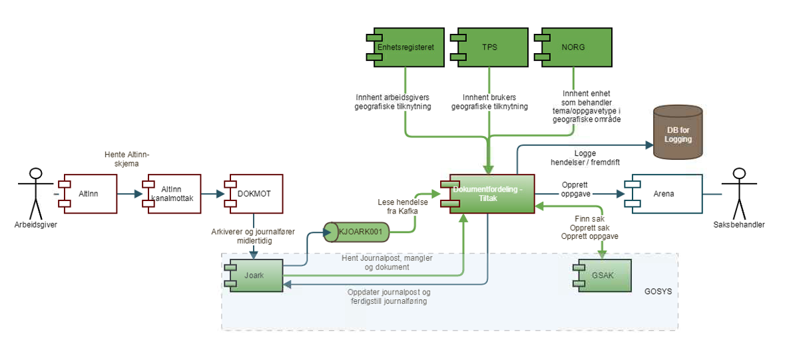
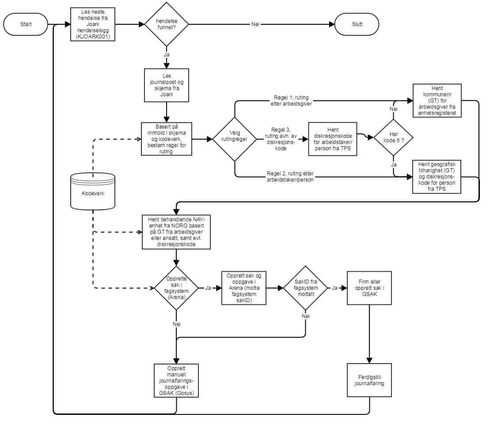

# Ekspertbistand

Dette repoet inneholder kode for håndtering av tiltaket Ekspertbistand. 
Den består av en frontend-applikasjon for innsending og utlisting av innsendte søknader, samt en backend-tjeneste for behandling av disse søknadene.

Applikasjonen er utviklet av Team Fager som en del av utfasing av Altinn 2 for NAV.
Den erstatter eksisterende løsning i Altinn 2 for Ekspertbistand.

For spørsmål eller bistand, kontakt Team Fager på Slack: [#team-fager](https://nav-it.slack.com/archives/C01V9FFEHEK)

## Eksisterende funksjonalitet i Altinn 2 som erstattes

Dette repoet erstatter funksjonalitet som tidligere var tilgjengelig i Altinn 2 for Ekspertbistand.
Tidligere sendte arbeidsgiver inn søknader om ekspertbistand via Altinn 2, hvor de ble rutet videre til saksbehandler.
Dette mottaket har vært under utfasing men er [beskrevet på confluence](https://confluence.adeo.no/spaces/TAD/pages/90553562/Verdikjeder). 

Når søknad sendes inn opprettes det en midlertidig journalpost og det sendes en kafka melding som lyttes på av [Dokumentfordeling](https://github.com/navikt/dokumentfordeling) applikasjonen.
Den applikasjonen ruter så videre journalposten til riktig saksbehandler basert på regler definert i applikasjonen.
Løsningsbeskrivelse for denne appen finnes [på confluence](https://confluence.adeo.no/spaces/AR/pages/294497858/Dokumentfordeling+-+tiltak+-+Funksjonell+bekrivelse#DokumentfordelingtiltakFunksjonellbekrivelse-Ruting). 

## Ny løsning 

I den nye løsningen sendes søknader direkte til Ekspertbistand applikasjonen uten å gå via Altinn 2.
Applikasjonen mottar søknader via en REST API som autentiseres med Azure AD.

Når en søknad mottas starter følgende prosess i applikasjonen:

1. Søknaden valideres og lagres i databasen og prosess trigges for videre behandling. (SkjemaInnsendt hendelse)
2. Avgjør behandlende enhet:  
- Sjekk Adressebeskyttelse i pdl for arbeidstaker
   - Hvis kode 6 aka. SPSF (Sperret adresse, strengt fortrolig) (PDL: STRENGT_FORTROLIG, STRENGT_FORTROLIG_UTLAND)
     - hent geotilknytning for arbeidstaker fra pdl, default NAV_VIKAFOSSEN:2103 dersom mangler
     - slå opp behandlende enhet i norg for geotilknytning og diskresjonskode SPSF
   - Hvis kode 7 aka. SPFO (Sperret adresse, fortrolig) (PDL: FORTROLIG)
     - rutes som normalt *
   - hvis ingen adressebeskyttelse
     - rutes som normalt * 
   - normalt *: 
     - slå opp kommunenr for virksomhet og slå opp behandlende enhet i norg for kommunenr
   - Untak: dersom behandlende enhet er NAV_ARBEIDSLIVSSENTER_NORDLAND:1891 må denne mappes om til 1899 som er NAV_ARBEIDSLIVSSENTER_NORDLAND_ARENA
     - TODO: sjekke om dette fortsatt gjelder og finne ut hvorfor?
3. opprett journalpost
4. opprett sak i arena
5. ferdigstill journalpost (TOOD: kan vi opprette og ferdigstille som et steg?)
6. send bekreftelse til arbeidsgiver via notifikasjonsplattformen
7. TODO: vurdere å sende melding til arbeidstaker på min side. Dette ser ikke ut som blir gjort i dagens løsning.

