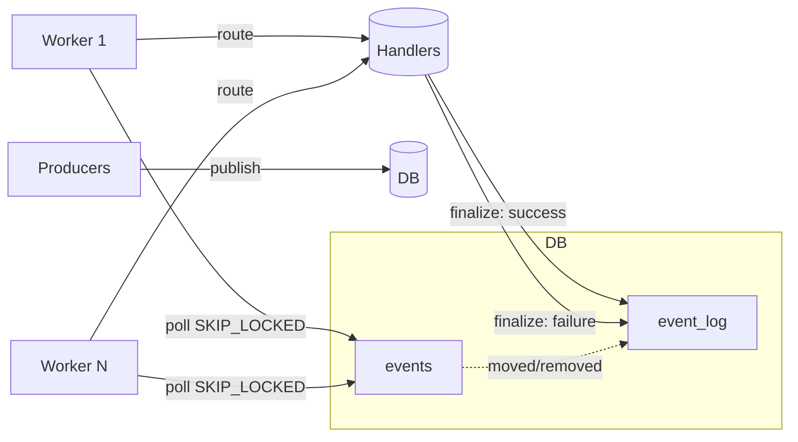
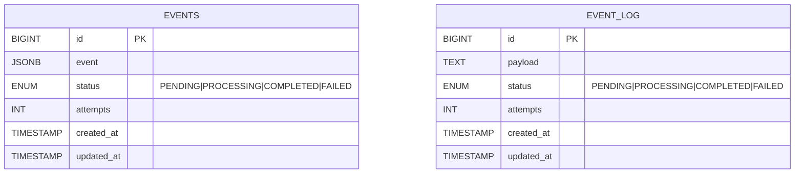

# EventBus design

This document describes the in-repo EventBus used by the backend for durable, at-least-once event processing. It covers responsibilities, data model, flow, concurrency, failure recovery, and operational tips.

## Overview

- Events are persisted in a relational database (table `events`).
- Workers poll the next eligible event using `SELECT … FOR UPDATE SKIP LOCKED` inside a transaction.
- The event is routed to a handler. On completion, the event is moved to `event_log` with a terminal status and removed from `events`.
- If a pod dies while processing, the event is considered abandoned and will be retried automatically after a timeout.

### Component diagram



## Data model



Recommended index (performance):
- events(status, updated_at, id)

Note: The current implementation determines abandonment based on `updated_at` age while status = PROCESSING.

## Lifecycle

- publish(event): Insert into `events` with status PENDING, attempts=0.
- poll(): Atomically select the earliest eligible row and mark it PROCESSING, incrementing attempts.
  - Eligibility: status = PENDING, or status = PROCESSING and `processing_started_at` older than the abandonment timeout.
  - On acquire: set `processing_started_at = now` and increment `attempts`.
- finalize(id, success): Insert into `event_log` with terminal status COMPLETED/FAILED and delete the row from `events`.

### Sequence (success, failure, abandonment recovery)

```mermaid
sequenceDiagram
    participant P as Producer
    participant EB as EventBus (DB)
    participant W as Worker
    participant R as Router/Handlers
    participant L as Event Log

    P->>EB: publish(event)
    Note over EB: events += {status: PENDING, attempts: 0}

    W->>EB: poll()
    activate EB
    EB->>EB: set status=PROCESSING, attempts=+1, updated_at=now
    EB->>EB: set status=PROCESSING, attempts=+1, processing_started_at=now
    deactivate EB

    W->>R: route(event)
    alt success
      R-->>W: OK
      W->>EB: finalize(id, success=true)
      EB->>L: insert log(COMPLETED)
      EB->>EB: delete from events
    else failure
      R-->>W: error
      W->>EB: finalize(id, success=false)
      EB->>L: insert log(FAILED)
      EB->>EB: delete from events
    end

    par Abandonment scenario
      Note over W: pod dies while PROCESSING
      W--xR: crash
      ... time passes ...
      W2->>EB: poll()
      EB-->>W2: selects PROCESSING event whose updated_at < now - timeout
      EB->>EB: attempts=+1, updated_at=now (re-acquired)
      W2->>R: route(event)
      R-->>W2: OK/err
      W2->>EB: finalize(...)
    end
```

## Concurrency and consistency

- Row-level locking: `SELECT … FOR UPDATE SKIP LOCKED` ensures one worker acquires one event; others skip locked rows.
- Transactions: selection + state transition to PROCESSING happens in one transaction.
- Visibility: after commit, the row is PROCESSING and won’t be re-selected until it becomes stale (abandoned) per timeout.
- Semantics: at-least-once delivery. Handlers must be idempotent.

## Abandoned events

- Timeout: Events stuck in PROCESSING are considered abandoned when `updated_at < now - abandonedTimeout`.
- Default timeout: 5 minutes (see `EventBus.abandonedTimeout`).
- On re-acquire: attempts++ and updated_at is refreshed.

## API surface (Kotlin)

- publish(event: Event): Unit
- poll(): Event?  // non-blocking; returns null if none
- finalize(id: Long, success: Boolean): Unit

Minimal example:

```kotlin
val job = GlobalScope.launch {
    while (isActive) {
        val ev = EventBus.poll()
        if (ev == null) {
            delay(10.seconds.toJavaDuration())
            continue
        }
        try {
            EventRouter.route(ev)
            EventBus.finalize(ev.id, success = true)
        } catch (t: Throwable) {
            EventBus.finalize(ev.id, success = false)
        }
    }
}
```

## Operational notes

- Indices: Add `events(status, updated_at, id)` in a migration for large volumes.
- Backoff: Workers already sleep briefly when no event is available; tune as needed.
- Indices: Add `events(status, processing_started_at, id)` in a migration for large volumes.
- Limits: Consider a max attempts policy to move perpetually failing events directly to `event_log` as FAILED.
  - Inspect stuck events: `select * from events where status='PROCESSING' and updated_at < now() - interval '5 minutes'`.
- Admin tasks:
  - Inspect stuck events: `select * from events where status='PROCESSING' and processing_started_at < now() - interval '5 minutes'`.
  - Manually requeue: `update events set status='PENDING' where id = ?` (use cautiously; normal recovery should handle this).

## References

- Implementation: `backend/src/main/kotlin/no/nav/ekspertbistand/event/EventBus.kt`
- Router: `backend/src/main/kotlin/no/nav/ekspertbistand/event/EventRouter.kt` (handlers registration)
