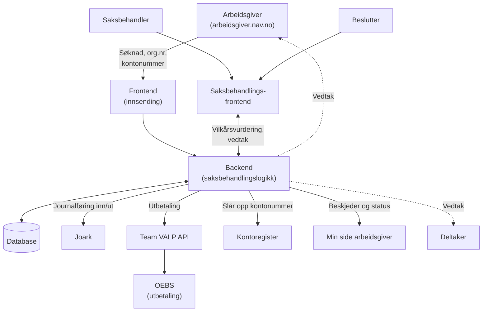

# Ekspertbistand

Dette repoet inneholder løsningen for tiltaket **ekspertbistand** i Nav, utviklet
av Team Fager. Løsningen erstatter den tidligere behandlingen i Altinn 2 og Arena.

Dokumentet forklarer hva ekspertbistand er og hva løsningen skal løse, slik at både
mennesker og AI-agenter raskt får domenekontekst før de leser koden. Teknisk
detalj ligger i `frontend/README.md`, `backend/README.md`, `ADR.md` og
`specifications/`.

For spørsmål, kontakt Team Fager på Slack:
[#team-fager](https://nav-it.slack.com/archives/C01V9FFEHEK).

## Hva er ekspertbistand?

Ekspertbistand er en tilskuddsordning for arbeidsgivere som har en ansatt med
langvarig eller gjentakende sykefravær. Arbeidsgiver kan hente inn en ekstern
ekspert som hjelper arbeidsgiver og den ansatte med å finne løsninger på det som
er vanskelig på arbeidsplassen. Nav gir tilskudd som dekker utgiftene til
eksperten.

Eksperten er en nøytral tredjepart med relevant kompetanse på arbeidsplass- og
sykefraværsproblematikk. Ordningen er beskrevet på
[nav.no/ekspertbistand](https://www.nav.no/ekspertbistand).

## Hvilket problem løser vi?

- **Arbeidsgiver** trenger hjelp når egne tiltak ikke er nok til å håndtere et
  langvarig eller gjentakende sykefravær, og skal slippe å bære kostnaden for
  ekstern ekspertise alene.
- **Arbeidstakeren (deltakeren)** trenger tiltak som gjør det mulig å stå i eller
  komme tilbake til arbeid.
- **Nav** vil redusere sykefravær og legge til rette for at flere blir i jobb, og
  må kunne behandle søknader og refusjonskrav effektivt og etterrettelig.

Behandlingen skjer i dag i Arena. Denne løsningen overtar saksbehandlingen når
Arena fases ut, og arbeidsgiver sender søknad direkte i stedet for via Altinn 2.

## Hva gjør løsningen?

Systemets formål er å legge til rette for saksbehandling av søknader og
refusjonskrav for tilskudd til ekspertbistand.

1. **Søknad.** Arbeidsgiver logger inn og sender søknad om tilskudd i
   frontend-applikasjonen (arbeidsgiver.nav.no).
2. **Fordeling.** Saker fordeles basert på virksomhetens organisasjonsnummer.
3. **Vilkårsvurdering.** En saksbehandler vurderer om vilkårene for tilskudd er
   oppfylt.
4. **Vedtak (to-trinns kontroll).** Saksbehandler foreslår utfall, og en beslutter
   godkjenner. Vedtak gis til arbeidsgiver og deltaker.
5. **Gjennomføring.** Eksperten bistår, og arbeidsgiver leverer sluttrapport.
6. **Refusjon.** Arbeidsgiver sender refusjonskrav. Ved avslag på refusjonskravet
   gis vedtaket til arbeidsgiver.
7. **Utbetaling.** Tilskuddet utbetales til kontonummeret arbeidsgiver har oppgitt
   i kontoregisteret.

Inn- og utgående dokumenter journalføres i Joark. Utbetaling skjer gjennom
integrasjon mot OEBS (utbetalingsløsningen) via Team VALPs API-er.

## Aktører og begreper

| Begrep | Betydning |
|--------|-----------|
| **Arbeidsgiver** | Virksomheten som søker om tilskudd og mottar refusjon. |
| **Deltaker / arbeidstaker** | Den ansatte som får bistand fra eksperten. |
| **Ekspert** | Ekstern fagperson som bistår arbeidsgiver og deltaker. |
| **Saksbehandler** | Utreder søknaden og vurderer vilkårene. |
| **Beslutter** | Godkjenner vedtaket i to-trinns kontroll. |
| **Søknad** | Det arbeidsgiver sender inn. |
| **Sak** | Navs behandling av en søknad. |
| **Vilkårsvurdering** | Vurderingen av om vilkårene for tilskudd er oppfylt. |
| **Vedtak** | Avgjørelsen om innvilgelse eller avslag. |
| **Refusjon** | Tilbakebetaling til arbeidsgiver av utgiftene til eksperten. |
| **Sluttrapport** | Arbeidsgivers rapport etter at bistanden er gjennomført. |

## Behandlingens livsløp

Diagrammet viser hvor opplysningene innhentes fra, hvordan de flyter under
behandlingen, og hvor de sendes videre i Nav eller til eksterne.

```mermaid
flowchart TD
    AG["Arbeidsgiver<br/>(arbeidsgiver.nav.no)"] -->|"Søknad, org.nr,<br/>kontonummer"| FE["Frontend<br/>(innsending)"]
    FE --> BE["Backend<br/>(saksbehandlingslogikk)"]
    BE <--> DB[("Database")]

    SBFE["Saksbehandlings-<br/>frontend"] <-->|"Vilkårsvurdering,<br/>vedtak"| BE
    SB["Saksbehandler"] --> SBFE
    BES["Beslutter"] --> SBFE

    BE -->|"Journalføring inn/ut"| JOARK["Joark"]
    BE -->|"Utbetaling"| VALP["Team VALP API"]
    VALP --> OEBS["OEBS<br/>(utbetaling)"]
    BE -->|"Slår opp kontonummer"| KONTO["Kontoregister"]
    BE -->|"Beskjeder og status"| MSA["Min side arbeidsgiver"]

    BE -.->|"Vedtak"| AG
    BE -.->|"Vedtak"| DELT["Deltaker"]
```

Opplysninger innhentes fra arbeidsgiver ved innsending og fra interne Nav-registre
under behandlingen. De flyter fra frontend til backend, lagres i databasen og
brukes av saksbehandlere. Videre sendes de til Joark (journalføring), til OEBS via
Team VALP (utbetaling) og til Min side arbeidsgiver (beskjeder og
statusoppdateringer). Kontonummer slås opp i kontoregisteret.

## Applikasjonene

Den nye løsningen tar imot søknader direkte, uten å gå via Altinn 2.

### Frontend

En React-app (Vite, TypeScript) for arbeidsgiver med innsendingsskjema og oversikt
over innsendte søknader. Se [frontend/README.md](/frontend/README.md).

### Backend

En Ktor-applikasjon i Kotlin med all logikk for behandling av søknader, saker og
integrasjoner (Joark, VALP/OEBS, Min side arbeidsgiver). Se
[backend/README.md](/backend/README.md).

## Videre lesing

- [frontend/README.md](/frontend/README.md) — frontend-applikasjonen.
- [backend/README.md](/backend/README.md) — backend-applikasjonen.
- [ADR.md](/ADR.md) — arkitekturbeslutning om asynkron prosessering.
- [specifications/](/specifications) — detaljerte spesifikasjoner for
  datamodell, ruter og integrasjoner.

## Bakgrunn: hva som erstattes

Tidligere sendte arbeidsgiver søknad om ekspertbistand via Altinn 2, hvor den ble
rutet videre til saksbehandler. Ved innsending ble det opprettet en midlertidig
journalpost og sendt en Kafka-melding som ble lyttet på av
[Dokumentfordeling](https://github.com/navikt/dokumentfordeling), som rutet
journalposten videre til riktig saksbehandler. Dette mottaket er
[beskrevet på Confluence](https://confluence.adeo.no/spaces/TAD/pages/90553562/Verdikjeder),
og rutingen er dokumentert i
[Dokumentfordeling – funksjonell beskrivelse](https://confluence.adeo.no/spaces/AR/pages/294497858/Dokumentfordeling+-+tiltak+-+Funksjonell+bekrivelse#DokumentfordelingtiltakFunksjonellbekrivelse-Ruting).
