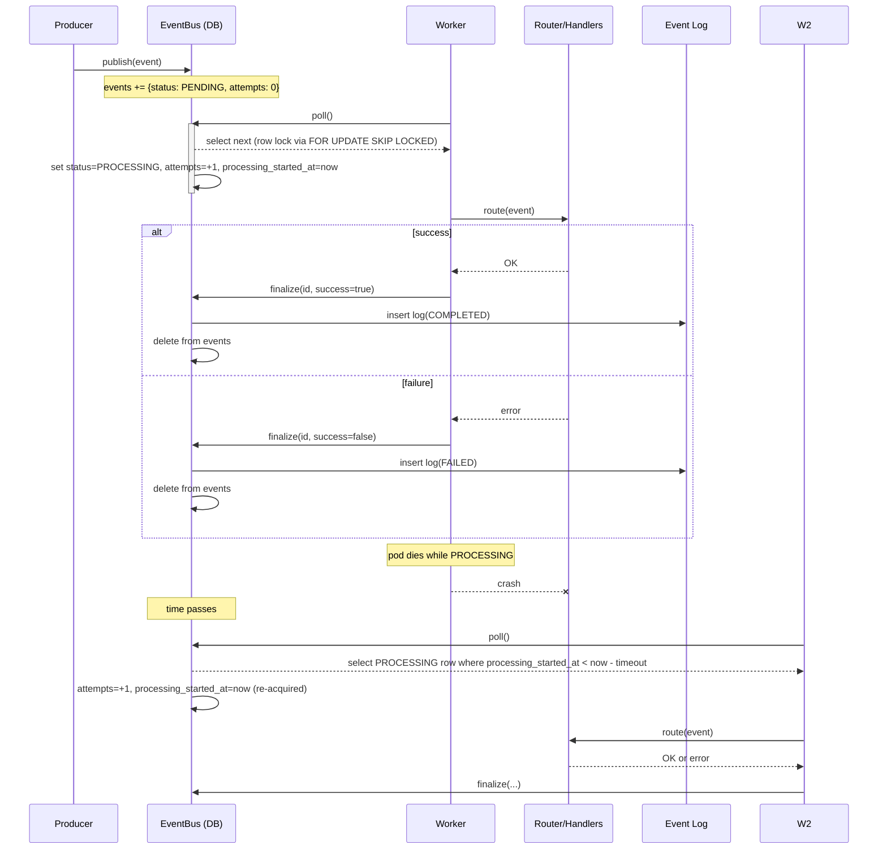

# EventBus

Design and usage of the in-repo EventBus used for durable, at-least-once event processing.

## Overview

- Events are stored in a relational database table `events`.
- Workers acquire events with `SELECT … FOR UPDATE SKIP LOCKED` to avoid races across pods.
- On completion, events are moved to `event_log` with a terminal status and removed from `events`.
- If a pod dies mid-processing, the event becomes eligible for re-processing after an abandonment timeout.

## Lifecycle

- publish(event): Insert into `events` with status PENDING, attempts=0.
- poll(): Atomically select the next eligible row and mark it PROCESSING, incrementing attempts.
  - Eligibility: status = PENDING, or status = PROCESSING and `processing_started_at` older than the abandonment timeout.
  - Uses `FOR UPDATE SKIP LOCKED` so only one worker acquires a row.
  - On acquire: set `processing_started_at = now` and increment `attempts`.
- finalize(id, success): Insert into `event_log` with status COMPLETED/FAILED and delete from `events`.

### Sequence diagrams

Success and failure paths plus abandonment recovery.



## Abandoned events

- Default timeout: 5 minutes (configured in code).
- Criteria: when status = PROCESSING and `processing_started_at < now - timeout`, the row is eligible to be re-acquired.
- Re-acquire effect: attempts is incremented and `processing_started_at` is refreshed to now.

## API (Kotlin)

- publish(event: Event)
- poll(): Event?  // non-blocking; returns null if none
- finalize(id: Long, success: Boolean)

Example worker loop:

```kotlin
while (isActive) {
    val ev = EventBus.poll() ?: run {
        kotlinx.coroutines.delay(10_000)
        continue
    }
    try {
        EventRouter.route(ev)
        EventBus.finalize(ev.id, success = true)
    } catch (e: CancelledException) {
        throw e
    } catch (e: Exception) {
        EventBus.finalize(ev.id, success = false)
    }
}
```

## Operational notes

- Monitor queue depth, attempts, processing latency, and failure rate.
- Consider a max attempts policy to shunt poison events to FAILED in `event_log`.
- Add the composite index noted above for scale.

## Source

- Implementation: `EventBus.kt`
- Router and handler registration: `EventRouter.kt`
