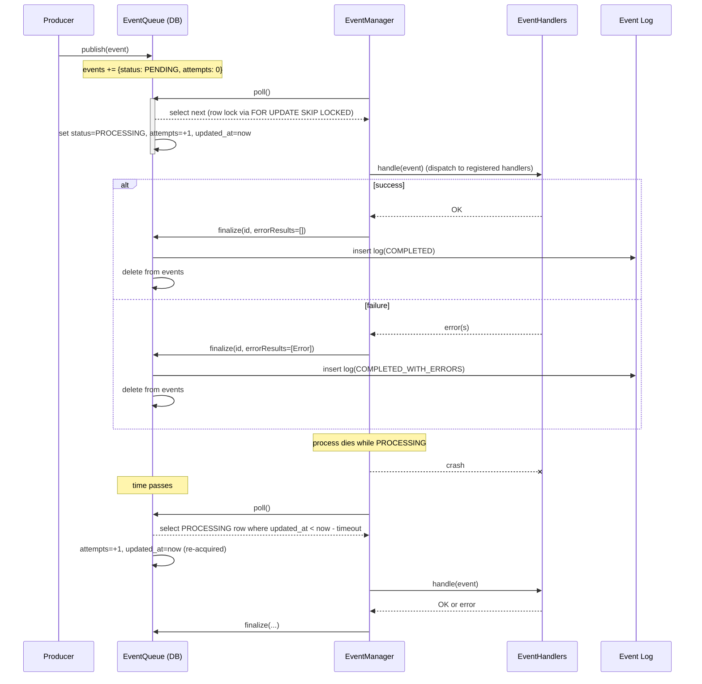
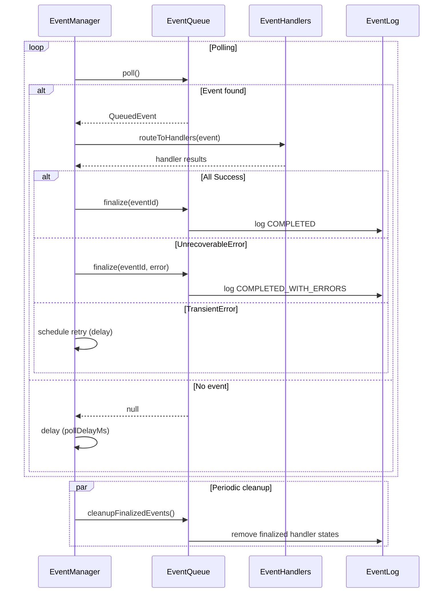

# EventQueue and EventManager

Durable, at-least-once event processing using a relational database queue and log.

## Usage
- Use `EventQueue` to publish events and manage their lifecycle.
- Use `EventManager` to process events from the queue, dispatching them to registered handlers.

## Overview

- QueuedEvents are stored in the `event_queue` table.
- EventManager acquires events using `SELECT ... FOR UPDATE SKIP LOCKED` to avoid races across pods/processes.
- On completion, events are moved to `event_log` with a terminal status and removed from `events`.
- If a process dies mid-processing, the event becomes eligible for re-processing after an abandonment timeout.

## Lifecycle

- `publish(event: Event)`: Insert into `events` with status PENDING, attempts=0.
- `poll(clock: Clock = Clock.System): QueuedEvent?`: Atomically select the next eligible row and mark it PROCESSING, incrementing attempts.
  - Eligibility: status = PENDING, or status = PROCESSING and `updated_at` older than the abandonment timeout.
  - Uses `FOR UPDATE SKIP LOCKED` so only one process acquires a row.
  - On acquire: set `status = PROCESSING`, `updated_at = now`, and increment `attempts`.
- `finalize(id: Long, errorResults: List<EventHandledResult.Error> = emptyList())`: Insert into `event_log` with status COMPLETED or COMPLETED_WITH_ERRORS, and delete from `events`.
  - Idempotent: If already finalized, does nothing.

### Sequence diagram

Event processing is managed by `EventManager`, which polls events from the queue and dispatches them to registered `EventHandler`s. On completion, events are finalized and moved to the log.




## Abandoned events

- Default timeout: 1 minute (configurable in code).
- Criteria: status = PROCESSING and `updated_at < now - timeout`.
- Re-acquire effect: attempts is incremented and `updated_at` is refreshed to now.

## API (Kotlin)

- `publish(event: Event): QueuedEvent` 
- `poll(clock: Clock = Clock.System): QueuedEvent?`  // non-blocking; returns null if none
- `finalize(id: Long, errorResults: List<EventHandledResult.Error> = emptyList())`

## Operational notes

- Monitor queue depth, attempts, processing latency, and failure rate.
- Consider a max attempts policy to shunt poison events to COMPLETED_WITH_ERRORS in `event_log`.

## EventManager

`EventManager` orchestrates event processing by polling the `EventQueue`, dispatching events to registered handlers, tracking handler results, and finalizing events. It ensures reliable, at-least-once delivery and supports retries for transient errors.

### Responsibilities
- Polls for new events from the queue at a configurable interval.
- Dispatches events to all registered `EventHandler`s.
- Tracks handler results: Success, TransientError, UnrecoverableError.
- Finalizes events when all handlers succeed or any handler returns a fatal error.
- Retries events with transient errors until the abandonment timeout is reached.
- Periodically cleans up finalized event handler states.

### API (Kotlin)
- `runProcessLoop()`: Starts the main event processing loop (polls, dispatches, finalizes). Designed to run in a coroutine.
- `cleanupFinalizedEvents()`: Periodically cleans up handler states for finalized events.

### Handler Registration
Handlers are registered via a builder lambda in the constructor:

```kotlin
val manager = EventManager {
    /**
     * handler via class instance 
     * this is the recommended approach
     */
    register(FooHandler())

    /**
     * handler via block delegate
     * useful for simple handlers or quick prototyping, 
     * id is required and must be unique
     */
    register<Event.Foo>("handler1") {
        if (stop == hammertime) {
            EventHandledResult.Success()
        } else {
            EventHandledResult.TransientError()
        }
    }

    /**
     * another example of handler via block delegate
     */
    register<Event.Foo>("handler2") {
        DummyFooHandler.handle(it)
    }
}
```

### Processing Logic
- Events are routed to all applicable handlers.
- Handler results are persisted and used to determine next steps:
  - **Success:** Event is finalized if all handlers succeed.
  - **TransientError:** Event is retried after a delay.
  - **UnrecoverableError:** Event is finalized with error status.
- Finalization moves the event to the log and removes it from the queue.

### Usage Example
```kotlin
val manager = EventManager { register(MyEventHandler()) }
runBlocking { manager.runProcessLoop() }
```

### Sequence diagram: EventManager internal process



### Event Log Projections

Once an event is finalized and moved to the `event_log`, projections can be built to create read-optimized views of the event data. 
See [EventLogProjectionBuilder](projections/README.md) for details.

### Source
- [EventQueue.kt](EventQueue.kt)
- [EventManager.kt](EventManager.kt)
