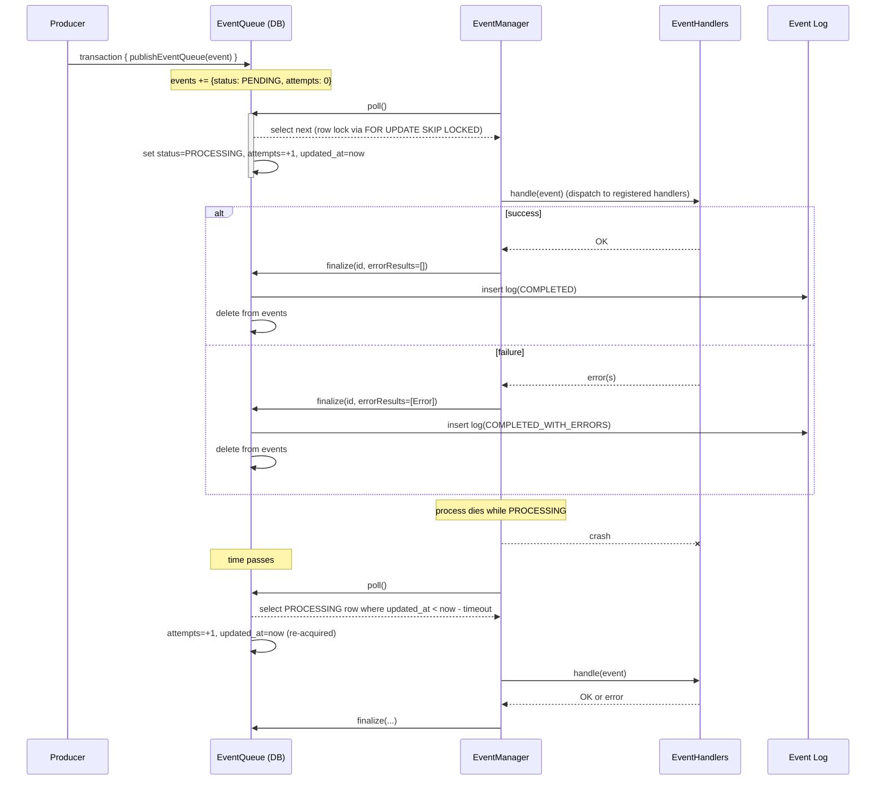
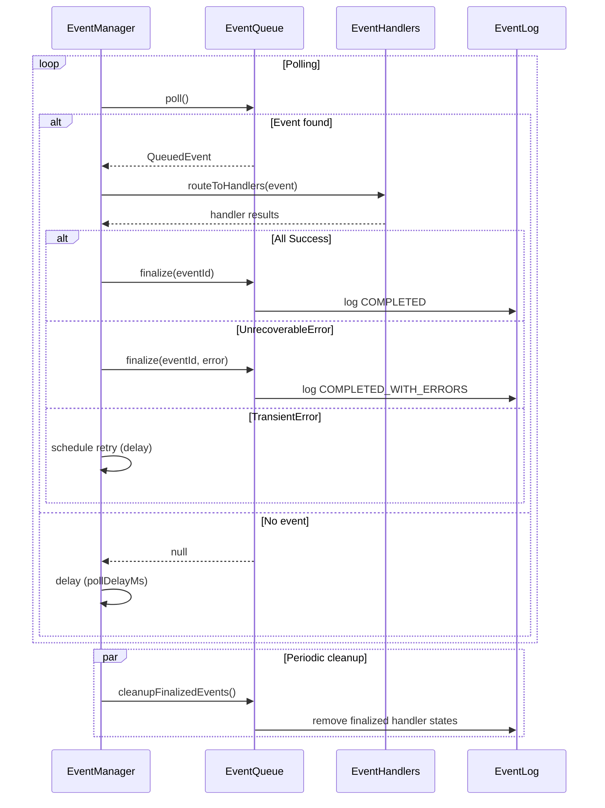

# EventQueue and EventManager

Durable, at-least-once event processing using a relational database queue and log.

## Usage
- Use `EventQueue` to publish events and manage their lifecycle.
- Use `EventManager` to process events from the queue, dispatching them to registered handlers.

### Publisering — ett inngangspunkt: `publishEventQueue`

Køen har nøyaktig én vei inn, og du skal aldri skrive til `event_queue`/`QueuedEvents` direkte:

- `fun JdbcTransaction.publishEventQueue(ev: EventData): QueuedEvent` — en extension-funksjon på
  toppnivå i `EventQueue.kt`. Den publiserer i **kallerens** pågående transaksjon og commiter/rulles
  tilbake med den. Receiveren er håndhevelsen: funksjonen finnes ikke utenfor en `transaction { }`-blokk,
  så publisering uten transaksjon er en **kompileringsfeil** — ingen `require`-vakter, ingen runtime-feilmodus.
  Inne i en `transaction { }` kalles den ukvalifisert: `publishEventQueue(ev)`.
- Kallere som ikke selv har en transaksjon (typisk route-handlere) åpner en selv:
  `transaction(database) { publishEventQueue(ev) }`. Da står skrivingen synlig på kallstedet.

**Aldri et suspend-kall inne i `transaction { }`** — åpne transaksjonen rundt skrivingen, ikke rundt
hele arbeidet (f.eks. dokgen-HTTP-kall). Se `TilsagnDataApi.hentTilskuddsbrevHtmlForSoknad`.

## `aggregateRootId` — felles aggregatrot på alle events

Hver `EventData` har en `aggregateRootId: String` som identifiserer aggregatroten hendelsen tilhører
(i praksis søknaden). Den **deriveres fra payload** og lagres bevisst *ikke* i `event_json` — kun i
kolonnen `aggregate_root_id` på `event_queue` og `event_log`. Dermed finnes det aldri to sannheter i
samme rad, og gamle/nye rader er byte-identiske i payload.

`publishEventQueue` skriver kolonnen ved publisering, og `finalize` kopierer den videre til
`event_log` (med derivering fra payload som fallback for eventuelle legacy-rader med `NULL`).

### Mapping per event-type

| Event-type | `aggregateRootId` |
|------------|-------------------|
| Alle med `soknad` (SoknadInnsendt, InnsendtSoknadJournalfoert, TiltaksgjennomforingOpprettet, TilskuddsbrevMottatt, TilskuddsbrevJournalfoert, SoknadAvlystIArena, SaksbehandlingStartetIArena, TilsagnsdataLagret) | `soknad.id` |
| `TilskuddsbrevMottattKildeAltinn`, `TilskuddsbrevJournalfoertKildeAltinn` | `tilsagnData.tilsagnNummer` satt sammen som `aar:loepenrSak:loepenrTilsagn` |
| `TilskuddsbrevVist` | `soknad?.id ?: tilsagnNummer` |

Derivings-SQL-en i backfillen (`AggregateRootIdBackfill`) speiler denne tabellen og valideres mot
faktisk serialisert payload i `AggregateRootIdBackfillTest`.

### Utrulling (engangs-migrering av eksisterende rader)

Kolonnen innføres i faser slik at ingen migrering holder en blokkerende lås gjennom en tabell-scan:

1. **Nullbar kolonne** (Flyway `V8`) + **modell/finalize-fallback** og en `CHECK … NOT VALID` på
   `event_log` (Flyway `V9`) som håndhever invarianten for alle *nye* rader.
2. **Backfill-jobb** (`AggregateRootIdBackfill`, startet fra `Application.kt`): fyller legacy-rader
   batch-vis, selv-avsluttende via `backfill_state.completed_at`. Når begge tabellene er ferdige
   kjører den P6 steg 1: `VALIDATE CONSTRAINT` på `event_log` (ikke-blokkerende SHARE UPDATE
   EXCLUSIVE-scan) og oppretter oppslagsindeksene `CONCURRENTLY`
   (`(aggregate_root_id, id)` på begge tabeller).
3. **`SET NOT NULL`** gjøres i en **egen, senere Flyway-migrering** (P6 steg 2), *etter* at
   verifiseringen under gir 0 i miljøet. Fordi den validerte checken allerede finnes, blir
   `SET NOT NULL` en O(1)-operasjon.

### Verifisering (kjøres i dev, så prod — må gi 0 før P6 steg 2)

```sql
-- 1. Ingen gjenstående NULL
SELECT count(*) FROM event_queue WHERE aggregate_root_id IS NULL;   -- forventet 0
SELECT count(*) FROM event_log   WHERE aggregate_root_id IS NULL;   -- forventet 0

-- 2. Kolonnen stemmer med payload for hele event_log
SELECT count(*) AS avvik
FROM event_log
WHERE aggregate_root_id IS DISTINCT FROM coalesce(
        event_json -> 'soknad' ->> 'id',
        nullif(concat_ws(':',
            event_json -> 'tilsagnData' -> 'tilsagnNummer' ->> 'aar',
            event_json -> 'tilsagnData' -> 'tilsagnNummer' ->> 'loepenrSak',
            event_json -> 'tilsagnData' -> 'tilsagnNummer' ->> 'loepenrTilsagn'
        ), ''),
        event_json ->> 'tilsagnNummer');                            -- forventet 0
```

Gauge `event.aggregaterootid.missing` (tagget på `table`) skal ligge flatt på 0 etter backfillen;
et hopp over 0 betyr en skrivevei som omgår `publishEventQueue`.

## Overview

- QueuedEvents are stored in the `event_queue` table.
- EventManager acquires events using `SELECT ... FOR UPDATE SKIP LOCKED` to avoid races across pods/processes.
- On completion, events are moved to `event_log` with a terminal status and removed from `events`.
- If a process dies mid-processing, the event becomes eligible for re-processing after an abandonment timeout.

## Lifecycle

- `JdbcTransaction.publishEventQueue(ev: EventData): QueuedEvent`: Insert into `event_queue` with status PENDING, attempts=0. Se «Publisering — ett inngangspunkt: `publishEventQueue`» over.
- `poll(clock: Clock = Clock.System): QueuedEvent?`: Atomically select the next eligible row and mark it PROCESSING, incrementing attempts.
  - Eligibility: status = PENDING, or status = PROCESSING and `updated_at` older than the abandonment timeout.
  - Uses `FOR UPDATE SKIP LOCKED` so only one process acquires a row.
  - On acquire: set `status = PROCESSING`, `updated_at = now`, and increment `attempts`.
- `finalize(id: Long, errorResults: List<EventHandledResult.Error> = emptyList())`: Insert into `event_log` with status COMPLETED or COMPLETED_WITH_ERRORS, and delete from `events`.
  - Idempotent: If already finalized, does nothing.

### Sequence diagram

Event processing is managed by `EventManager`, which polls events from the queue and dispatches them to registered `EventHandler`s. On completion, events are finalized and moved to the log.


```mermaid
sequenceDiagram
    participant P as Producer
    participant Q as EventQueue (DB)
    participant M as EventManager
    participant H as EventHandlers
    participant L as Event Log

    P->>Q: transaction { publishEventQueue(event) }
    Note over Q: events += {status: PENDING, attempts: 0}

    M->>Q: poll()
    activate Q
    Q-->>M: select next (row lock via FOR UPDATE SKIP LOCKED)
    Q->>Q: set status=PROCESSING, attempts=+1, updated_at=now
    deactivate Q

    M->>H: handle(event) (dispatch to registered handlers)
    alt success
      H-->>M: OK
      M->>Q: finalize(id, errorResults=[])
      Q->>L: insert log(COMPLETED)
      Q->>Q: delete from events
    else failure
      H-->>M: error(s)
      M->>Q: finalize(id, errorResults=[Error])
      Q->>L: insert log(COMPLETED_WITH_ERRORS)
      Q->>Q: delete from events
    end

    Note over M: process dies while PROCESSING
    M--xH: crash
    Note over Q: time passes
    M->>Q: poll()
    Q-->>M: select PROCESSING row where updated_at < now - timeout
    Q->>Q: attempts=+1, updated_at=now (re-acquired)
    M->>H: handle(event)
    H-->>M: OK or error
    M->>Q: finalize(...)
```


## Abandoned events

- Default timeout: 1 minute (configurable in code).
- Criteria: status = PROCESSING and `updated_at < now - timeout`.
- Re-acquire effect: attempts is incremented and `updated_at` is refreshed to now.

## API (Kotlin)

- `JdbcTransaction.publishEventQueue(ev: EventData): QueuedEvent`
- `poll(clock: Clock = Clock.System): QueuedEvent?`  // non-blocking; returns null if none
- `finalize(id: Long, errorResults: List<EventHandledResult.Error> = emptyList())`

## Operational notes

- Monitor queue depth, attempts, processing latency, and failure rate.
- Consider a max attempts policy to shunt poison events to COMPLETED_WITH_ERRORS in `event_log`.

## EventManager

`EventManager` orchestrates event processing by polling the `EventQueue`, dispatching events to registered handlers, tracking handler results, and finalizing events. It ensures reliable, at-least-once delivery and supports retries for transient errors.

### Responsibilities
- Polls for new events from the queue at a configurable interval.
- Dispatches events to all registered `EventHandler`s.
- Tracks handler results: Success, TransientError, UnrecoverableError.
- Finalizes events when all handlers succeed or any handler returns a fatal error.
- Retries events with transient errors until the abandonment timeout is reached.
- Periodically cleans up finalized event handler states.

### API (Kotlin)
- `runProcessLoop()`: Starts the main event processing loop (polls, dispatches, finalizes). Designed to run in a coroutine.
- `cleanupFinalizedEvents()`: Periodically cleans up handler states for finalized events.

### Handler Registration
Handlers are registered via a builder lambda in the constructor:

```kotlin
val manager = EventManager {
    /**
     * handler via class instance 
     * this is the recommended approach
     */
    register(FooHandler())

    /**
     * handler via block delegate
     * useful for simple handlers or quick prototyping, 
     * id is required and must be unique
     */
    register<Event.Foo>("handler1") {
        if (stop == hammertime) {
            EventHandledResult.Success()
        } else {
            EventHandledResult.TransientError()
        }
    }

    /**
     * another example of handler via block delegate
     */
    register<Event.Foo>("handler2") {
        DummyFooHandler.handle(it)
    }
}
```

### Processing Logic
- Events are routed to all applicable handlers.
- Handler results are persisted and used to determine next steps:
  - **Success:** Event is finalized if all handlers succeed.
  - **TransientError:** Event is retried after a delay.
  - **UnrecoverableError:** Event is finalized with error status.
- Finalization moves the event to the log and removes it from the queue.

### Usage Example
```kotlin
val manager = EventManager { register(MyEventHandler()) }
runBlocking { manager.runProcessLoop() }
```

### Sequence diagram: EventManager internal process


```mermaid
sequenceDiagram
    participant EM as EventManager
    participant EQ as EventQueue
    participant EH as EventHandlers
    participant LOG as EventLog

    loop Polling
        EM->>EQ: poll()
        alt Event found
            EQ-->>EM: QueuedEvent
            EM->>EH: routeToHandlers(event)
            EH-->>EM: handler results
            alt All Success
                EM->>EQ: finalize(eventId)
                EQ->>LOG: log COMPLETED
            else UnrecoverableError
                EM->>EQ: finalize(eventId, error)
                EQ->>LOG: log COMPLETED_WITH_ERRORS
            else TransientError
                EM->>EM: schedule retry (delay)
            end
        else No event
            EQ-->>EM: null
            EM->>EM: delay (pollDelayMs)
        end
    end
    par Periodic cleanup
        EM->>EQ: cleanupFinalizedEvents()
        EQ->>LOG: remove finalized handler states
    end
```

### Event Log Projections

Once an event is finalized and moved to the `event_log`, projections can be built to create read-optimized views of the event data. 
See [EventLogProjectionBuilder](projections/README.md) for details.

### Source
- [EventQueue.kt](EventQueue.kt)
- [EventManager.kt](EventManager.kt)
