# Event-flyt

<!-- GENERERT FIL – ikke rediger manuelt. -->
<!-- Oppdater ved å kjøre main i backend/src/test/kotlin/no/nav/ekspertbistand/executables/EventFlowDiagram.kt -->

Generert ved statisk analyse av `src/main/kotlin` (se `executables/EventFlowDiagram.kt`).

- **Kilde** (oransje parallellogram): kode utenfor event-systemet som publiserer events (API, Kafka-konsumenter).
- **Event** (blå, avrundet): `EventData`-type. Rød betyr at eventen mangler publiserer eller konsument.
- **Handler** (mørkt rektangel): `EventHandler` som konsumerer én event-type og kan publisere nye.
- **Projeksjon** (grønn, stiplet): `EventLogProjectionBuilder` som leser fra event-loggen.

```mermaid
flowchart TD
    classDef source fill:#ff9100,stroke:#7a3d00,stroke-width:2px,color:#000,font-weight:bold
    classDef event fill:#0067c5,stroke:#002d5a,stroke-width:2px,color:#fff,font-weight:bold
    classDef handler fill:#262626,stroke:#000,stroke-width:2px,color:#fff
    classDef projection fill:#06893a,stroke:#00341a,stroke-width:2px,stroke-dasharray: 5 3,color:#fff
    classDef orphan fill:#c30000,stroke:#5c0000,stroke-width:3px,color:#fff,font-weight:bold

    s_ArenaTilsagnsbrevProcessor[/"ArenaTilsagnsbrevProcessor"/]:::source
    s_ArenaTiltaksgjennomforingEndretProcessor[/"ArenaTiltaksgjennomforingEndretProcessor"/]:::source
    s_ArenaTiltakssakEndretProcessor[/"ArenaTiltakssakEndretProcessor"/]:::source
    s_SoknadApi[/"SoknadApi"/]:::source
    s_TilsagnDataApi[/"TilsagnDataApi"/]:::source
    e_InnsendtSoknadJournalfoert(["InnsendtSoknadJournalfoert"]):::event
    e_SaksbehandlingStartetIArena(["SaksbehandlingStartetIArena"]):::event
    e_SoknadAvlystIArena(["SoknadAvlystIArena"]):::event
    e_SoknadInnsendt(["SoknadInnsendt"]):::event
    e_TilsagnsdataLagret(["TilsagnsdataLagret"]):::event
    e_TilskuddsbrevJournalfoert(["TilskuddsbrevJournalfoert"]):::event
    e_TilskuddsbrevJournalfoertKildeAltinn(["TilskuddsbrevJournalfoertKildeAltinn"]):::event
    e_TilskuddsbrevMottatt(["TilskuddsbrevMottatt"]):::event
    e_TilskuddsbrevMottattKildeAltinn(["TilskuddsbrevMottattKildeAltinn"]):::event
    e_TilskuddsbrevVist(["TilskuddsbrevVist"]):::event
    e_TiltaksgjennomforingOpprettet(["TiltaksgjennomforingOpprettet"]):::event
    h_JournalfoerInnsendtSoknad["JournalfoerInnsendtSoknad"]:::handler
    h_JournalfoerNotatArenaSakOpprettet["JournalfoerNotatArenaSakOpprettet"]:::handler
    h_JournalfoerTilskuddsbrev["JournalfoerTilskuddsbrev"]:::handler
    h_JournalfoerTilskuddsbrevKildeAltinn["JournalfoerTilskuddsbrevKildeAltinn"]:::handler
    h_LagreTilsagnsData["LagreTilsagnsData"]:::handler
    h_LagreTilsagnsDataKildeAltinn["LagreTilsagnsDataKildeAltinn"]:::handler
    h_MarkerSakUnderBehandlingIArena["MarkerSakUnderBehandlingIArena"]:::handler
    h_OpprettTiltaksgjennomfoeringForInnsendtSoknad["OpprettTiltaksgjennomfoeringForInnsendtSoknad"]:::handler
    h_SettAvlystSoknadStatus["SettAvlystSoknadStatus"]:::handler
    h_SettGodkjentSoknadStatus["SettGodkjentSoknadStatus"]:::handler
    h_TilskuddsbrevVistNoop["TilskuddsbrevVistNoop"]:::handler
    h_VarsleArbeidsgiverSoknadAvlyst["VarsleArbeidsgiverSoknadAvlyst"]:::handler
    h_VarsleArbeidsgiverSoknadGodkjent["VarsleArbeidsgiverSoknadGodkjent"]:::handler
    h_VarsleArbeidsgiverSoknadGodkjentKildeAltinn["VarsleArbeidsgiverSoknadGodkjentKildeAltinn"]:::handler
    h_VarsleArbeidsgiverSoknadMottatt["VarsleArbeidsgiverSoknadMottatt"]:::handler
    p_SoknadBehandletForsinkelseProjection[["SoknadBehandletForsinkelseProjection"]]:::projection
    p_TilskuddsbrevVistProjection[["TilskuddsbrevVistProjection"]]:::projection

    s_ArenaTilsagnsbrevProcessor --> e_TilskuddsbrevMottatt
    s_ArenaTilsagnsbrevProcessor --> e_TilskuddsbrevMottattKildeAltinn
    s_ArenaTiltaksgjennomforingEndretProcessor --> e_SoknadAvlystIArena
    s_ArenaTiltakssakEndretProcessor --> e_SaksbehandlingStartetIArena
    h_JournalfoerInnsendtSoknad --> e_InnsendtSoknadJournalfoert
    h_JournalfoerTilskuddsbrev --> e_TilskuddsbrevJournalfoert
    h_JournalfoerTilskuddsbrevKildeAltinn --> e_TilskuddsbrevJournalfoertKildeAltinn
    h_LagreTilsagnsData --> e_TilsagnsdataLagret
    h_OpprettTiltaksgjennomfoeringForInnsendtSoknad --> e_TiltaksgjennomforingOpprettet
    s_SoknadApi --> e_SoknadInnsendt
    s_TilsagnDataApi --> e_TilskuddsbrevVist
    e_SoknadInnsendt --> h_JournalfoerInnsendtSoknad
    e_TiltaksgjennomforingOpprettet --> h_JournalfoerNotatArenaSakOpprettet
    e_TilskuddsbrevMottatt --> h_JournalfoerTilskuddsbrev
    e_TilskuddsbrevMottattKildeAltinn --> h_JournalfoerTilskuddsbrevKildeAltinn
    e_TilskuddsbrevJournalfoert --> h_LagreTilsagnsData
    e_TilskuddsbrevJournalfoertKildeAltinn --> h_LagreTilsagnsDataKildeAltinn
    e_SaksbehandlingStartetIArena --> h_MarkerSakUnderBehandlingIArena
    e_InnsendtSoknadJournalfoert --> h_OpprettTiltaksgjennomfoeringForInnsendtSoknad
    e_SoknadAvlystIArena --> h_SettAvlystSoknadStatus
    e_TilskuddsbrevJournalfoert --> h_SettGodkjentSoknadStatus
    e_TilskuddsbrevVist --> h_TilskuddsbrevVistNoop
    e_SoknadAvlystIArena --> h_VarsleArbeidsgiverSoknadAvlyst
    e_TilsagnsdataLagret --> h_VarsleArbeidsgiverSoknadGodkjent
    e_TilskuddsbrevJournalfoertKildeAltinn --> h_VarsleArbeidsgiverSoknadGodkjentKildeAltinn
    e_TiltaksgjennomforingOpprettet --> h_VarsleArbeidsgiverSoknadMottatt
    e_SoknadAvlystIArena -.-> p_SoknadBehandletForsinkelseProjection
    e_SoknadInnsendt -.-> p_SoknadBehandletForsinkelseProjection
    e_TilskuddsbrevMottatt -.-> p_SoknadBehandletForsinkelseProjection
    e_TilskuddsbrevMottatt -.-> p_TilskuddsbrevVistProjection
    e_TilskuddsbrevMottattKildeAltinn -.-> p_TilskuddsbrevVistProjection
    e_TilskuddsbrevVist -.-> p_TilskuddsbrevVistProjection
    linkStyle default stroke:#555,stroke-width:2px
```

