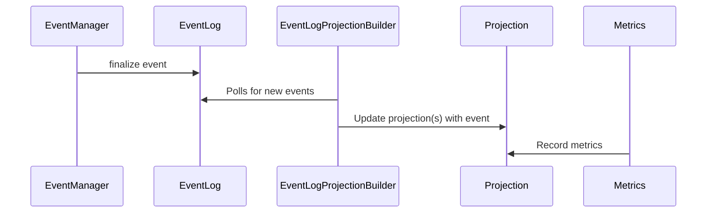

# EventLogProjectionBuilder 

The `EventLogProjectionBuilder` is responsible for constructing and updating projections based on events stored in the `EventLog`. Projections are read-optimized views or models derived from the sequence of events, enabling efficient queries and reporting.

## Sequence Diagram

Below is a Mermaid sequence diagram illustrating the flow between the `EventLog`, `EventLogProjectionBuilder`, and projections:

For details on the EventManager / EventLog, see [events/README](../README.md).

## Flow Description

1. **EventLog**: Stores all domain events in an append-only fashion.
2. **EventLogProjectionBuilder**: Listens to new events in the `EventLog` and applies them to update one or more projections.
3. **Projections**: Materialized views (e.g., `TilskuddsbrevVistProjection`, `SoknadBehandletForsinkelseProjection`) that are updated by the builder and used for efficient querying.

## Example

- When a new event is appended to the `EventLog`, the `EventLogProjectionBuilder` processes the event and updates the relevant projections.
- Projections are then used by the application to serve queries without scanning the entire event log.

