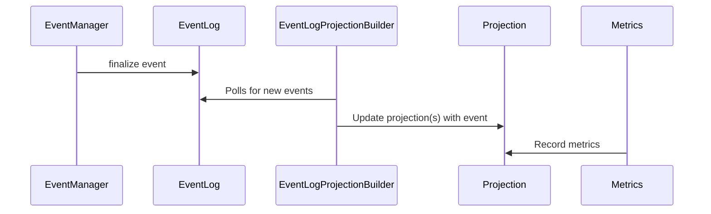

# EventLogProjectionBuilder 

The `EventLogProjectionBuilder` is responsible for constructing and updating projections based on events stored in the `EventLog`. Projections are read-optimized views or models derived from the sequence of events, enabling efficient queries and reporting.

## Sequence Diagram

Below is a Mermaid sequence diagram illustrating the flow between the `EventLog`, `EventLogProjectionBuilder`, and projections:

For details on the EventManager / EventLog, see [events/README](../README.md).

```mermaid
sequenceDiagram
    participant EventManager
    participant EventLog
    participant EventLogProjectionBuilder
    participant Projection 
    participant Metrics 

    EventManager->>EventLog: finalize event
    EventLogProjectionBuilder->>EventLog: Polls for new events
    EventLogProjectionBuilder->>Projection: Update projection(s) with event
    Metrics->>Projection: Record metrics
```

## Flow Description

1. **EventLog**: Stores all domain events in an append-only fashion.
2. **EventLogProjectionBuilder**: Listens to new events in the `EventLog` and applies them to update one or more projections.
3. **Projections**: Materialized views (e.g., `TilskuddsbrevVistProjection`, `SoknadBehandletForsinkelseProjection`, `SakProjection`) that are updated by the builder and used for efficient querying.

## SakProjection

`SakProjection` bygger `sak`-tabellen for søknader som behandles i Arena. Se
[`specifications/sak_projection.md`](../../../../../../../../../specifications/sak_projection.md).

| Event | Effekt på `sak` |
|-------|-----------------|
| `SoknadInnsendt` | Oppretter saken (`OPPRETTET`, `kilde_til_behandling = ARENA`), men kun hvis søknaden finnes og ikke allerede har en sak |
| `InnsendtSoknadJournalfoert` | Setter `behandlende_enhet`, mappet tilbake fra Arena- til Norg-enhetsnummer (`BehandlendeEnhetService.arenaTilNorgEnhetNr`) |
| `TiltaksgjennomforingOpprettet` | Setter `arena_sak_id` |
| `SaksbehandlingStartetIArena` | `UNDER_BEHANDLING`, kun fra `OPPRETTET` |
| `TilskuddsbrevMottatt` | `INNVILGET`, med mindre saken allerede er `INNVILGET`/`AVSLATT` |
| `SoknadAvlystIArena` | `AVSLATT`, med mindre saken allerede er `INNVILGET`/`AVSLATT` |

`opprettet` og `sist_endret` settes fra eventens tidspunkt, slik at replay gir riktige tidspunkter.

For å kjøre hele projeksjonen på nytt, bump versjonen i `name` (for eksempel `Sak-v2` → `Sak-v3`). Den nye
builderen starter på posisjon 0. Eksisterende saker opprettes ikke på nytt, men feltene deres oppdateres.

## Example

- When a new event is appended to the `EventLog`, the `EventLogProjectionBuilder` processes the event and updates the relevant projections.
- Projections are then used by the application to serve queries without scanning the entire event log.

