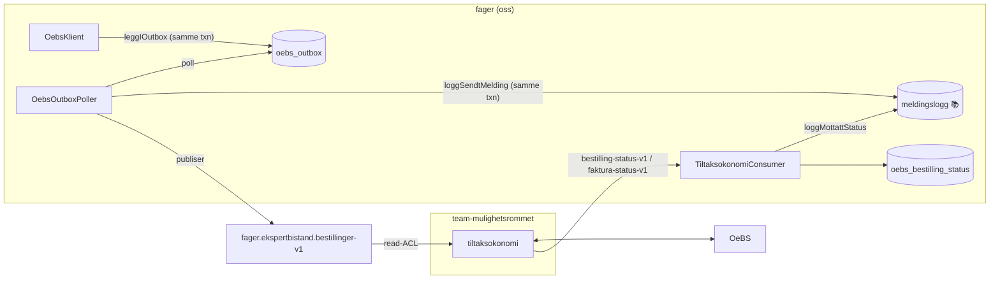
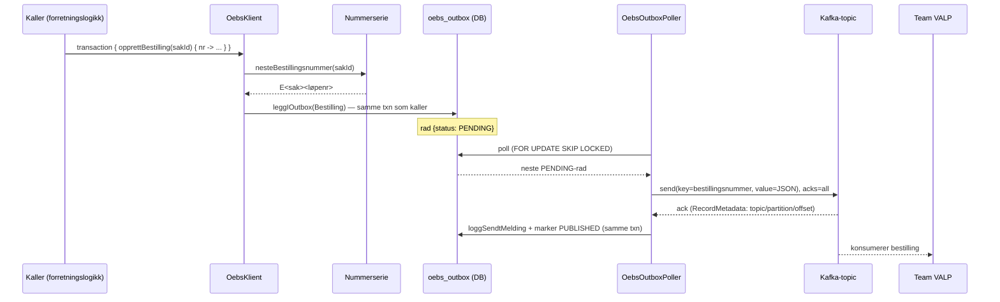
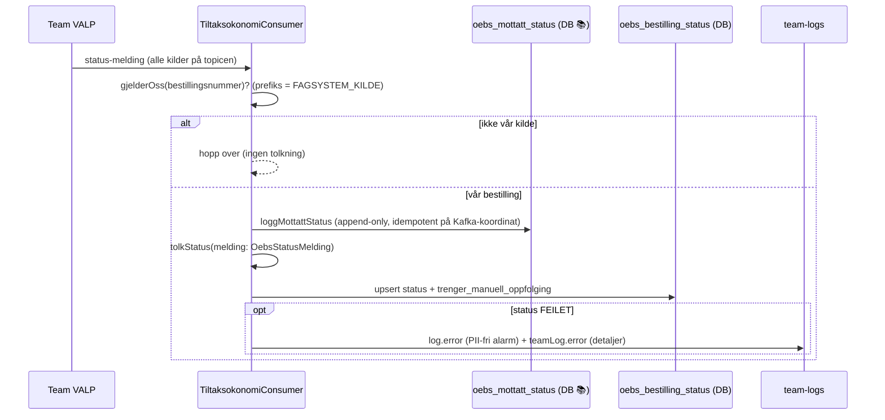

# OeBS / tiltaksøkonomi-integrasjon

Integrasjon mot OeBS (Oracle e-Business Suite) for å **sette av penger (bestille), utbetale
(fakturere), annullere og gjøre opp** tilskudd for ekspertbistand.

Ekspertbistand er et **eget kildesystem** i OeBS med **egen nummerserie**, men snakker ikke direkte
med OeBS. All kommunikasjon går via Team VALP sin tiltaksøkonomi-tjeneste
([`mulighetsrommet-tiltaksokonomi`](https://github.com/navikt/mulighetsrommet/tree/main/mulighetsrommet-tiltaksokonomi)),
som eier kontrakten mot OeBS.

> Se den fulle spesifikasjonen i
> [`specifications/integrasjon_oebs_tiltaksokonomi_bestilling.md`](../../../../../../../../specifications/integrasjon_oebs_tiltaksokonomi_bestilling.md).

## Kontekst

Vi publiserer bestillinger på **vår egen** topic. VALP abonnerer (read-ACL), oversetter til OeBS, og
sender status tilbake på **sine** status-topics som vi lytter på.

## Hvorfor outbox-mønster?

Kafka-produsenten er innkapslet i et **outbox-mønster** (jf. spec-beslutning 11): kallere skriver
meldingen til `oebs_outbox` i **samme databasetransaksjon** som sin egen forretningsendring, og en
bakgrunnspoller publiserer radene til Kafka etterpå.

Konsekvensen er at vi ikke har en hard avhengighet til Kafka-oppetid, og at publiseringsfeil ikke
blør innover i forretningslogikken — en feilet publisering blir liggende i outbox-en og prøves igjen.
Dette speiler mønsteret i [`event`-pakken](../event/README.md) (`FOR UPDATE SKIP LOCKED`).

### Skriveflyt (bestilling → OeBS)

### Statusflyt (OeBS → oss)

> Status-topicene deles av alle kilder i tiltaksøkonomi. Consumeren filtrerer tidlig på vår
> fagsystembokstav (`FAGSYSTEM_KILDE`, første tegn i bestillingsnummeret) og ignorerer andres
> meldinger før tolkningen kjører.

## Etterlevelse (varig revisjonsspor)

Vi må kunne **svare for hva vi har bestilt og hvilke svar vi fikk** — dette er et etterlevelseskrav.
Kafka-topicene har 90 dagers retention, så vi kan ikke lene oss på dem for dette, og selv om OeBS
har rapporter må vi kunne dokumentere vår egen side av kommunikasjonen.

Derfor logges både utgående meldinger og innkommende svar **append-only** i egen database, atskilt
fra arbeidsdataene:

- **Utgående** (`oebs_sendt_melding`): polleren skriver den nøyaktig serialiserte meldingen i **samme
  transaksjon** som den markerer outbox-raden `PUBLISHED`, med Kafka-koordinatene fra `RecordMetadata`.
  Da stemmer revisjonssporet alltid med det som faktisk ble publisert.
- **Innkommende** (`oebs_mottatt_status`): consumeren skriver **hele** råmeldingen for hvert svar som
  gjelder oss, *før* rød-sone-tolkningen — så vi fanger alt vi mottok selv om tolkningen ikke er ferdig.
  Idempotent på Kafka-koordinatene (`topic`/`partition`/`offset`) så reprosessering ikke gir duplikater.

Dette skiller **revisjonsspor** (`oebs_sendt_melding`, `oebs_mottatt_status` — aldri overskrevet) fra
**arbeidsdata** (`oebs_outbox` som dreneres, `oebs_bestilling_status` som holder siste tilstand).

## Struktur

Pakken har tre lag. Start i `Oebs.kt` (inngangen) og følg tråden derfra.

**Inngang — `oebs/` (det du forholder deg til):**

| Fil | Ansvar | Sone |
|-----|--------|------|
| [`Oebs.kt`](Oebs.kt) | `OebsKlient` (skrive-API), `OebsProcessor` + `Application.startOebsProsessering()` (oppstart) | 🟢 (ikke wiret inn ennå) |

**Kafka-integrasjon + wire-kontrakter — `oebs/integration/`:**

| Fil | Ansvar | Sone |
|-----|--------|------|
| [`OebsBestillingMelding.kt`](integration/OebsBestillingMelding.kt) | Lokalt speilet utgående meldingsmodell + verdityper + `Json`-instans | 🟢 (wire-parity ✅) |
| [`OebsStatusMelding.kt`](integration/OebsStatusMelding.kt) | Lokalt speilte status-DTO-er fra VALP (`BestillingStatus`/`FakturaStatus` + enums, `OebsStatusMelding`) | 🟢 (wire-parity ✅) |
| [`TiltaksokonomiProducer.kt`](integration/TiltaksokonomiProducer.kt) | Idempotent Kafka-produsent (`acks=all`, SSL fra `KAFKA_*`) | 🟢 |
| [`TiltaksokonomiConsumer.kt`](integration/TiltaksokonomiConsumer.kt) | Lytter på VALP sine status-topics, deserialiserer til typet modell, tolker status, lagrer siste status | 🟢 |

**Persistens (Exposed-tabeller + hjelpere) — `oebs/model/`:**

| Fil | Ansvar | Sone |
|-----|--------|------|
| [`Outbox.kt`](model/Outbox.kt) | `oebs_outbox`-tabell + `JdbcTransaction.leggIOutbox` (skriveside) + `OebsOutboxPoller` (drenering til Kafka) | 🟢 |
| [`Nummerserie.kt`](model/Nummerserie.kt) | `oebs_lopenummer`- + `oebs_faktura_lopenummer`-tabeller + `FAGSYSTEM_KILDE` + nummergeneratorer (bestilling + faktura) | 🟢 |
| [`Meldingslogg.kt`](model/Meldingslogg.kt) | Varig revisjonsspor: `loggSendtMelding` / `loggMottattStatus` (etterlevelse) | 🟢 |
| [`BestillingStatusTabell.kt`](model/BestillingStatusTabell.kt) | `oebs_bestilling_status`-tabell (siste status per bestilling) | 🟢 |

**Migreringer / plattform:**

| Fil | Ansvar | Sone |
|-----|--------|------|
| [`V12__oebs_tiltaksokonomi.sql`](../../../../../resources/db/migration/V12__oebs_tiltaksokonomi.sql) | Flyway: outbox-, løpenummer- og statustabeller | 🟢 |
| [`V13__oebs_meldingslogg.sql`](../../../../../resources/db/migration/V13__oebs_meldingslogg.sql) | Flyway: revisjonsspor (sendt/mottatt melding) | 🟢 |
| [`V14__oebs_faktura_lopenummer.sql`](../../../../../resources/db/migration/V14__oebs_faktura_lopenummer.sql) | Flyway: løpenummer-serie for fakturaer (per bestilling) | 🟢 |
| [`nais/{dev,prod}-gcp-topic-bestillinger.yaml`](../../../../../../../../nais) | Topic-manifest + ACL | 🟢 |

## Datamodell

| Tabell | Rolle |
|--------|-------|
| `oebs_outbox` | Utgående meldinger, drenert til Kafka av polleren (arbeidsdata) |
| `oebs_lopenummer` | Neste ledige løpenummer per sak (én rad per sak) |
| `oebs_bestilling_status` | Siste status per bestilling, med flagg for manuell oppfølging (arbeidsdata) |
| `oebs_sendt_melding` | 📚 Revisjonsspor: hver melding vi publiserte, med Kafka-koordinater (append-only) |
| `oebs_mottatt_status` | 📚 Revisjonsspor: hvert svar vi mottok, rått og komplett (append-only) |

## Meldingsmodell og kontrakt

`OebsBestillingMelding` er en `sealed class` med diskriminatorene `BESTILLING`, `ANNULLERING`,
`FAKTURA` og `GJOR_OPP_BESTILLING`. Modellen er **speilet lokalt** (ikke tatt inn som avhengighet,
jf. spec-beslutning 8) med samme `@SerialName` og feltnavn som VALP.

> ✅ **Kontrakt-parity:** Wire-formatet (feltnavn, `type`-diskriminator og serialisering av
> verdityper som `Periode` og `Organisasjonsnummer`) er verifisert mot faktiske VALP-eksempelmeldinger
> i `OebsBestillingMeldingContractTest`. Nestede sealed classes bruker VALP sine **navngitte**
> diskriminatorer (`NAV_ANSATT`, `NORSK`, `BBAN` osv.), og `NavAnsatt` har kun `navIdent` på wire
> (det tidligere `part`-feltet er fjernet av VALP).

## 🔴 Rød sone — økonomikritisk logikk (nå implementert)

Disse delene er økonomikritiske og ble skrevet og forstått av teamet, ikke blindt generert:

- **Nummerserie-generering, bestilling** (`nesteBestillingsnummer`) — ✅ implementert:
  transaksjonssikker les-og-inkrementer under `FOR UPDATE`, med lengdevalidering (≤ 20 tegn).
- **Nummerserie-generering, faktura** (`nesteFakturanummer`) — ✅ implementert: løpenummer per
  faktura per bestilling, format `<bestillingsnummer>-<faktura-løpenr>`, lengdevalidering (≤ 50 tegn).
- **Outbox-poller** (`OebsOutboxPoller.startProcessing`) — ✅ implementert: `SKIP_LOCKED`-poll →
  publiser → `loggSendtMelding` + marker `PUBLISHED` i én transaksjon (radlåsen holdes gjennom
  publiseringen), med backoff ved feil. At-least-once: raden markeres aldri `PUBLISHED` før meldingen
  faktisk er ute, og et duplikat ved retry er ufarlig (idempotent produsent + OeBS-dedup).
- **Tolkning av avviste operasjoner** (`TiltaksokonomiConsumer.tolkStatus`) — ✅ implementert: kun
  `FEILET` (jf. enum-doc) trigger manuell oppfølging; status nøkles på `referanse`
  (bestillings-/fakturanummer) så en vellykket faktura ikke nullstiller et oppfølgingsflagg på en
  feilet bestilling.

`NummerserieTest` (sekvens per sak/bestilling, samtidighet og lengdegrense), `OutboxTest`
(publisering + `PUBLISHED` i én transaksjon, og at publiseringsfeil lar raden ligge `PENDING`) og
`TiltaksokonomiConsumerTest` (tolkning, kilde-filtrering og at flagg ikke nullstilles) er skrevet og
aktive; øvrige testskjeletter i
[`src/test/.../oebs`](../../../../../../test/kotlin/no/nav/ekspertbistand/oebs) er `@Ignore` til de er
implementert.

> `Application.startOebsProsessering` (i `Oebs.kt`) er **ikke** koblet inn i `Application.main()` ennå.
> Rød-sone-logikken er nå skrevet, men wiring avventer ekstern koordinering med Team VALP (read-ACL på
> status-topicene + at ekspertbistand-kilden og enum-verdiene er lagt inn hos VALP).

## Gjenstående eksterne avhengigheter

- **Fagsystembokstav/kilde**: bruker `E` midlertidig (`FAGSYSTEM_KILDE`), må bekreftes mot OeBS.
- **VALP** må legge inn `EKSPERTBISTAND` / `TILTAK_EKSPERTBISTAND` / ekspertbistand-kilde i sine
  enum-er og abonnere på `fager.ekspertbistand.bestillinger-v1` før meldinger godtas.
