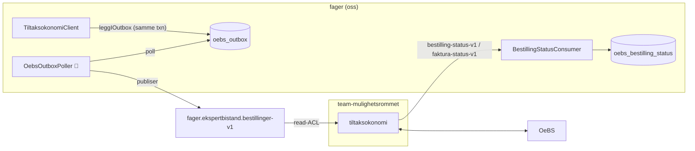
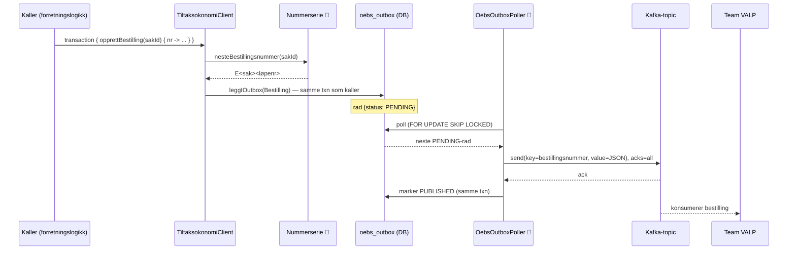
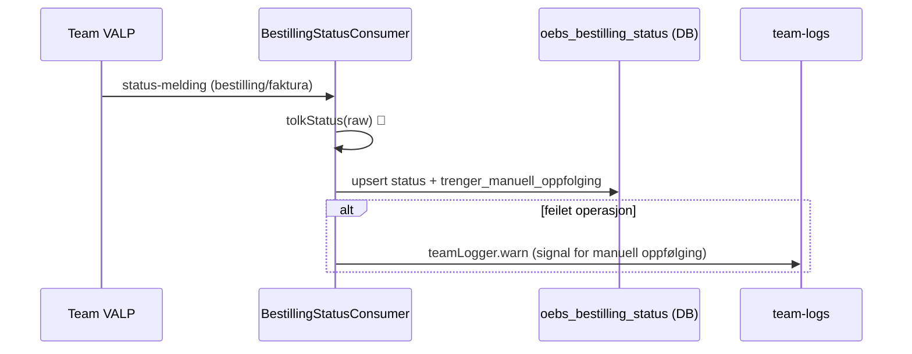

# OeBS / tiltaksøkonomi-integrasjon

Integrasjon mot OeBS (Oracle e-Business Suite) for å **sette av penger (bestille), utbetale
(fakturere), annullere og gjøre opp** tilskudd for ekspertbistand.

Ekspertbistand er et **eget kildesystem** i OeBS med **egen nummerserie**, men snakker ikke direkte
med OeBS. All kommunikasjon går via Team VALP sin tiltaksøkonomi-tjeneste
([`mulighetsrommet-tiltaksokonomi`](https://github.com/navikt/mulighetsrommet/tree/main/mulighetsrommet-tiltaksokonomi)),
som eier kontrakten mot OeBS.

> Se den fulle spesifikasjonen i
> [`specifications/integrasjon_oebs_tiltaksokonomi_bestilling.md`](../../../../../../../../specifications/integrasjon_oebs_tiltaksokonomi_bestilling.md).

## Kontekst

Vi publiserer bestillinger på **vår egen** topic. VALP abonnerer (read-ACL), oversetter til OeBS, og
sender status tilbake på **sine** status-topics som vi lytter på.

## Hvorfor outbox-mønster?

Kafka-produsenten er innkapslet i et **outbox-mønster** (jf. spec-beslutning 11): kallere skriver
meldingen til `oebs_outbox` i **samme databasetransaksjon** som sin egen forretningsendring, og en
bakgrunnspoller publiserer radene til Kafka etterpå.

Konsekvensen er at vi ikke har en hard avhengighet til Kafka-oppetid, og at publiseringsfeil ikke
blør innover i forretningslogikken — en feilet publisering blir liggende i outbox-en og prøves igjen.
Dette speiler mønsteret i [`event`-pakken](../event/README.md) (`FOR UPDATE SKIP LOCKED`).

### Skriveflyt (bestilling → OeBS)

### Statusflyt (OeBS → oss)

## Komponenter

| Fil | Ansvar | Sone |
|-----|--------|------|
| [`OkonomiBestillingMelding.kt`](OkonomiBestillingMelding.kt) | Lokalt speilet meldingsmodell + verdityper + `Json`-instans | 🟢 (wire-parity ⚠️) |
| [`TiltaksokonomiProducer.kt`](TiltaksokonomiProducer.kt) | Idempotent Kafka-produsent (`acks=all`, SSL fra `KAFKA_*`) | 🟢 |
| [`Outbox.kt`](Outbox.kt) | `oebs_outbox`-tabell + `JdbcTransaction.leggIOutbox` (skriveside) + poller-stub | 🟢 skrive / 🔴 poller |
| [`Nummerserie.kt`](Nummerserie.kt) | `oebs_lopenummer`-tabell + `FAGSYSTEM_KILDE` + nummergenerator | 🔴 |
| [`TiltaksokonomiClient.kt`](TiltaksokonomiClient.kt) | Internt API: bestille / fakturere / annullere / gjøre opp | 🟢 |
| [`BestillingStatusConsumer.kt`](BestillingStatusConsumer.kt) | Lytter på VALP sine status-topics, lagrer status | 🟢 skjelett / 🔴 tolkning |
| [`OebsProsessering.kt`](OebsProsessering.kt) | Oppstart av poller + status-konsument | 🟢 (ikke wiret inn ennå) |
| [`V12__oebs_tiltaksokonomi.sql`](../../../../../resources/db/migration/V12__oebs_tiltaksokonomi.sql) | Flyway: outbox-, løpenummer- og statustabeller | 🟢 |
| [`nais/{dev,prod}-gcp-topic-bestillinger.yaml`](../../../../../../../../nais) | Topic-manifest + ACL | 🟢 |

## Datamodell

| Tabell | Rolle |
|--------|-------|
| `oebs_outbox` | Utgående meldinger, drenert til Kafka av polleren |
| `oebs_lopenummer` | Neste ledige løpenummer per sak (én rad per sak) |
| `oebs_bestilling_status` | Siste status per bestilling, med flagg for manuell oppfølging |

## Meldingsmodell og kontrakt

`OkonomiBestillingMelding` er en `sealed class` med diskriminatorene `BESTILLING`, `ANNULLERING`,
`FAKTURA` og `GJOR_OPP_BESTILLING`. Modellen er **speilet lokalt** (ikke tatt inn som avhengighet,
jf. spec-beslutning 8) med samme `@SerialName` og feltnavn som VALP.

> ⚠️ **Kontrakt-parity:** Wire-formatet (feltnavn, `type`-diskriminator og serialisering av
> verdityper som `Periode` og `Organisasjonsnummer`) må matche VALP eksakt. Dette er ikke fullt
> verifisert ennå — se `OkonomiBestillingMeldingContractTest` (skjelett) og kanttilfellene i spec-en.

## 🔴 Rød sone — implementeres av teamet

Disse delene er bevisst lagt igjen som stubber (`TODO`) fordi de er økonomikritiske og bør forstås
grundig, ikke genereres:

- **Nummerserie-generering** (`nesteBestillingsnummer`) — transaksjonssikker les-og-inkrementer.
- **Outbox-poller** (`OebsOutboxPoller.startProcessing`) — `SKIP_LOCKED`-poll → publiser → marker
  `PUBLISHED` i én transaksjon, med retry/backoff (at-least-once).
- **Tolkning av avviste operasjoner** (`BestillingStatusConsumer.tolkStatus`) — avgjør hva som er
  feilet/avvist og når det krever manuell oppfølging.

Testskjeletter finnes i
[`src/test/.../oebs`](../../../../../../test/kotlin/no/nav/ekspertbistand/oebs) (`@Ignore` til de er
implementert).

> `OebsProsessering.startOebsProsessering` er **ikke** koblet inn i `Application.main()` ennå. Den
> kaster `TODO(...)` fra rød sone, så den skal først wires inn når logikken over er skrevet.

## Gjenstående eksterne avhengigheter

- **Fagsystembokstav/kilde**: bruker `E` midlertidig (`FAGSYSTEM_KILDE`), må bekreftes mot OeBS.
- **VALP** må legge inn `EKSPERTBISTAND` / `TILTAK_EKSPERTBISTAND` / ekspertbistand-kilde i sine
  enum-er og abonnere på `fager.ekspertbistand.bestillinger-v1` før meldinger godtas.
